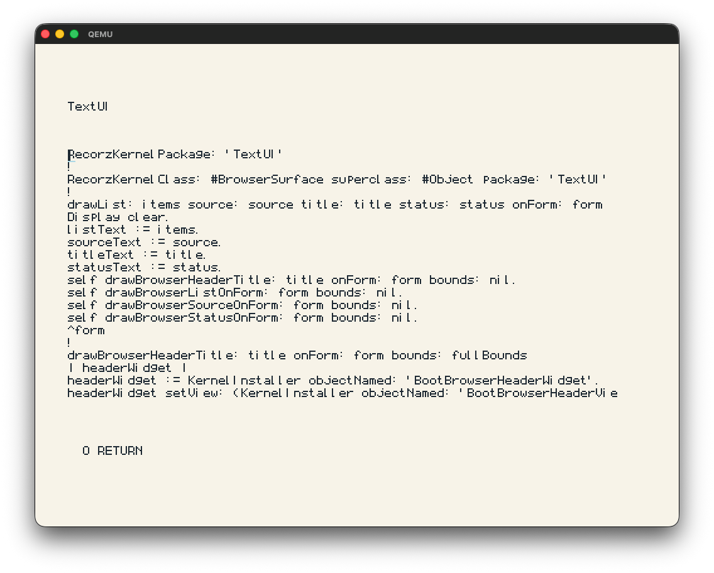

# Recorz

Recorz is a Phase 1 Smalltalk/Strongtalk-inspired seed system built around a live image, a minimal inspectable VM, and a path toward self-hosted development on RISC-V. The current focus is a clean RV32-first environment where source, tools, and runtime behavior stay visible and understandable while the image-owned workspace/browser matures.

Today, Recorz already boots on QEMU RISC-V with framebuffer output, live source loading, snapshots, and an in-image workspace/editor. That is the implemented Phase 1 surface. The longer-term goal is a compact but expressive system that remains faithful to classic image-based development while opening room for gradual typing, systems work, hardware description, and capability-oriented isolation.

The next staged work is tracked in [docs/post_phase_1_roadmap.md](/Users/david/repos/recorz/docs/post_phase_1_roadmap.md) and [docs/post_phase_1_execution_plan.md](/Users/david/repos/recorz/docs/post_phase_1_execution_plan.md). The Bluebook-style runtime/tool parity program is complete on the RV32 primary path and recorded in [docs/bluebook_vm_parity_roadmap.md](/Users/david/repos/recorz/docs/bluebook_vm_parity_roadmap.md) and [docs/bluebook_vm_parity_execution_plan.md](/Users/david/repos/recorz/docs/bluebook_vm_parity_execution_plan.md).

The host Python builders remain bootstrap machinery. Files like [build_qemu_riscv_mvp_image.py](/Users/david/repos/recorz/tools/build_qemu_riscv_mvp_image.py) and [generate_qemu_riscv_mvp_runtime_bindings_header.py](/Users/david/repos/recorz/tools/generate_qemu_riscv_mvp_runtime_bindings_header.py) should stay mechanical and derivational, with workspace, browser, debugger, and process-tool policy owned by the image-side source.



*The screenshot shows the live package browser and workspace editor running on the RV32 target.*

## Quick Start

Recorz currently targets QEMU RISC-V first. The main host-side prerequisites are:
- `qemu-system-riscv32`
- `riscv64-unknown-elf-gcc`
- `python3`
- `make`

To boot the current RV32 framebuffer demo:

```sh
make -C /Users/david/repos/recorz/platform/qemu-riscv32 run
```

For the normal RV32 in-image development loop, use the auto-resume target:

```sh
make -C /Users/david/repos/recorz/platform/qemu-riscv32 dev-loop
```

`dev-loop` reopens the saved image automatically after `Ctrl-W`, so save/resume feels like one continuous development session. The older one-shot entry remains available as `dev-interactive`.

In the interactive workspace, the primary commands are:
- `Ctrl-D` do it
- `Ctrl-P` print it
- `Ctrl-X` accept
- `Ctrl-O` close/return
- `Ctrl-W` save the snapshot and continue when launched through `dev-loop`
- `Ctrl-K` save a checkpointed image state

If you need to roll back to the previous saved image:

```sh
make -C /Users/david/repos/recorz/platform/qemu-riscv32 dev-restore
```
